*meow
*woof
*mooo
_________________________________________________________________________________________________
LAB REPORT 1

CD

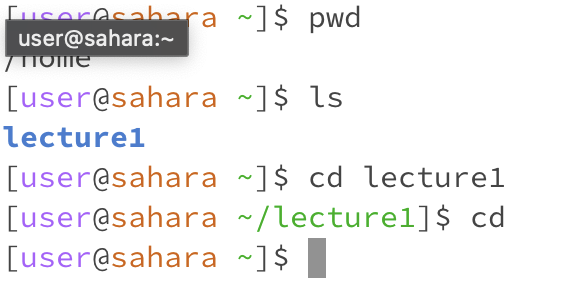

1. no argument, working directory was simply the home directory because i was working within there, because there was no argument the directory was never changed because i didnt tell the program what directory to switch to, this is not an error! However, when I cd to lecture1, then ran cd w no argument it simply backed up one level to the home directory. this is not an error. 
2. run w directory, when the command was run i changed the directory from simply the repository to lecture1, my output was that i was working within the lecture1 directory as evidenced by my next command line. this makes sense because id told the program to work within the lecture1 directory, this is not an error!
3. run w file, it was within the lecture1 directory when i tried to run w Hello.java, then i changed directory to messages and tried to run the txt files. i got the error outputs because i passed in a file name as arguments, but you can't work within a file and that argument isn't accepted for the cd command (literally tells you it changes to a directory), so this is an error!


LS


1. no argument, i was in the messages directory when i ran this so the output was a list of the text files with "hello world" in a couple different languages because those were the files within the messages directory, and the ls command lists the contents in a directory, so this is not an error!
2. directory, i did this twice. the first time (picture 1) i was working within the messages directory, and it gave me an error message that said it could not access the file or directory. that is because i was already in there and it was looking for a directory within the one i was already in. however, in picture 2 i backed out using cd .., and when i worked within the lecture1 directory, and ran ls messages the terminal successfully listed the text files within messages
3. run w file, in picture 1 under ls i was in the messages directory and ran ls en-us.txt. it outputted the contents of the file which is simply itself, this is not an error

   
CAT


1. no argument, i was in the messages directory and it simply returned my cursor down the terminal and let me type within the terminal freely- that is where i tried to run cat messages and then it simply reprinted what id typed. this is not an error
2. run w directory, in the first picture you can see it says no such file or directory which is not error message when i ran it within the messages directory. however, i backed out to just the repository (picture 2) and found the cat lecture 1 outputted a descritpion of lecture1 as a directory. when i tried to run cat messages, i got a message that said there is no such file or directory, this is not an error. I suppose cat only works on the first layer and didn't search the lecture1 directory for the messages directory another layer deeper.
3. run w file, in picture 1 under cat i was in the messages directory and i ran cat en-us.txt, which printed the contents of the file to the terminal because id passed the file name as an argument into the command. this is not an error


______________________________________________________________________________________________________
Lab Report 2

PART 1


This calls the `handlerequest` method, and the relevant fields are `r` and `num`. `r` changed from "1. mew" to "1. mew \n 2. hellooo", and `num` changed from 1 to 2. The url i typed in was passed in, the path was "/add-message?=hellooo". all fields changed. 


This calls the `handlerequest` method, and the relevant fields are `r` and `num`. `r` changed from "1. mew \n 2. hellooo" to "1. mew \n 2. hellooo \n 3. okayipullup", and `num` changed from 2 to 3. The url i typed in was passed in, the path was "/add-message?=okayipullup". all fields changed. 

below is my code for StringServer!


PART 2

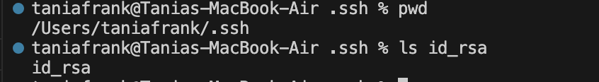

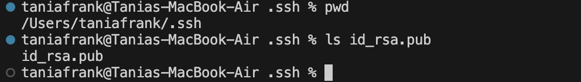


I added the ls commands in terminal- it didn't print out the whole path, but the TA told me to pwd, then ls the file to show that it is there and present in that absolute file path!

PART 3
I didn't know that you could remotely connect to a computer, that was new to me. My understanding for the most part was that we run things from the coputer we are physically on, so learning how to do that conceptually was cool. I suppose, specifically the ssh command and the process of logging into my cs15l account
/Users/taniafrank/.ssh/id_rsa.pub


--------------------------------------------------------------------------------------------------------------------------------
LAB 3

Part 1
A failure-inducing input for the buggy program, as a JUnit test and any associated code (write it as a code block in Markdown)
I am choosing the bug in arraymethods!
These are the failure inducing inputs, junit tests

```
@Test
public void testReverseInPlacefive() {
int[] input1 = {1,2,3,4,5 };
ArrayExamples.reverseInPlace(input1);
assertArrayEquals(new int[]{5,4,3,2,1 }, input1);
}
```

An input that doesn’t induce a failure, as a JUnit test and any associated code (write it as a code block in Markdown)

```
@Test
public void testReverseInPlace-singular() {
int[] input1 = {3};
assertArrayEquals(new int[]{3}, ArrayExamples.reversed(input1));
}
```

The symptom, as the output of running the tests (provide it as a screenshot of running JUnit with at least the two inputs above)
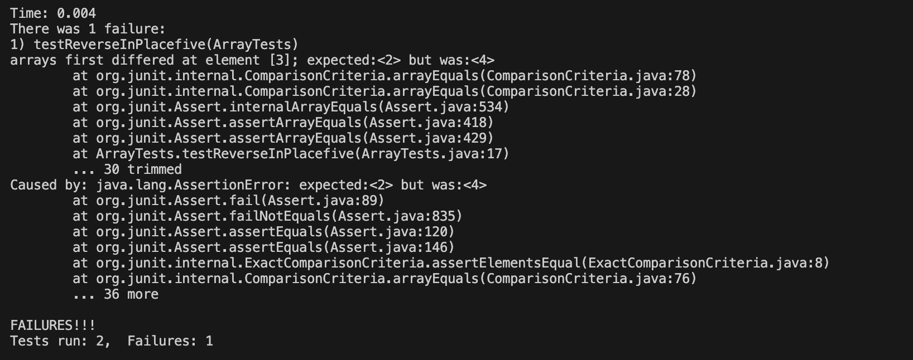
The bug, as the before-and-after code change required to fix it (as two code blocks in Markdown)
Before

```
static void reverseInPlace(int[] arr) {
    int[] newArray = arr;
    for(int i = 0; i < arr.length; i += 1) {
      arr[i] = newArray[arr.length - i - 1];
    }
  }
```
  
After

```
static void reverseInPlace(int[] arr) {
    int[] newArray = arr;
    for(int i = 0; i < arr.length; i += 1) {
      newArray[i] = arr[arr.length - i - 1];
    }
    for(int i = 0; i < arr.length; i +=1){
      arr[i] = newArray[i];
    }
  }
```
  
This fixes the problem because in the old version its trying to assign values from the array that hasn't been set yet to the old one. In this change I copy the values in the old array to the new one, reversed. Then copy it back. You can't do it all in one step because we need access to values on the flip side of the array.

PART 2
```
-name
```
SOURCE: 

```
man
```
find in terminal

```
taniafrank@Tanias-MacBook-Air docsearch % find . -name "1468*.txt"
./technical/biomed/1468-6708-3-10.txt
./technical/biomed/1468-6708-3-4.txt
./technical/biomed/1468-6708-3-7.txt
./technical/biomed/1468-6708-3-3.txt
./technical/biomed/1468-6708-3-1.txt
taniafrank@Tanias-MacBook-Air docsearch % find . -name "911report"
./technical/911report
```

This command simply finds the files that are named appropriately according to the name in the quotes. This is useful because you can see how many/what files exist according to your qualification, or even if they exist in the first place!

```
-ls
```

SOURCE: man find in terminal

```
taniafrank@Tanias-Air docsearch % find . -name  "1468-6708-3-1.txt" -ls
4724554       48 -rwxr-xr-x    1 taniafrank       staff               24112 Oct 31 08:15 ./technical/biomed/1468-6708-3-1.txt
taniafrank@Tanias-Air docsearch % find . -name  "biomed" -ls           
4724553        0 drwxr-xr-x  839 taniafrank       staff               26848 Oct 31 08:15 ./technical/biomed
```

This command lists the full path and metainformation about whatever you are finding (in conjunction with the name command). this is incredibly helpful because it shows you exactly where the file is and information about it, in case you have lost it.

```
-print
```

SOURCE: https://www.liquidweb.com/kb/how-to-use-the-find-command-in-linux/#:~:text=Find%20a%20File%20or%20Directory,iname%20for%20case%20insensitive%20checks).&text=Here%20you%20use%20a%20period,to%20represent%20the%20current%20directory.

```
taniafrank@Tanias-Air docsearch % find . -name  "biomed" -print
./technical/biomed
taniafrank@Tanias-Air docsearch % find . -name  "1468-6708-3-1.txt" -prin
t
./technical/biomed/1468-6708-3-1.txt
```

This command prints out the full path name of the file when used with the -name command. This is helpful because it shows you the exact file path of a file, incase you lose it.

```
-size
```
SOURCE: https://www.liquidweb.com/kb/how-to-use-the-find-command-in-linux/#:~:text=Find%20a%20File%20or%20Directory,iname%20for%20case%20insensitive%20checks).&text=Here%20you%20use%20a%20period,to%20represent%20the%20current%20directory. 

```
taniafrank@Tanias-Air docsearch % find . -size -1
./countingfiles.txt
taniafrank@Tanias-Air docsearch % find . -size +400
./lib/junit-4.13.2.jar
./.git/objects/pack/pack-9155f305b04899d32718c159a69aedd038c25dbf.pack
./technical/government/About_LSC/commission_report.txt
./technical/government/Env_Prot_Agen/bill.txt
./technical/government/Gen_Account_Office/GovernmentAuditingStandards_yb2002ed.txt
./technical/government/Gen_Account_Office/Statements_Feb28-1997_volume.txt
./technical/government/Gen_Account_Office/d01591sp.txt
./technical/911report/chapter-13.4.txt
./technical/911report/chapter-13.5.txt
./technical/911report/chapter-3.txt
```

This command lists out the files/packages that follow the qualification of what size qualifier you pick: +# means anything with a size larger than # and -# indicates smaller than. this is a qualifier for space.

___________________________________________________________________________________________________________________________________
LAB 4------------------------------------------------------------------------------------------------------------------------------
STEPS:
4. Log into ieng6
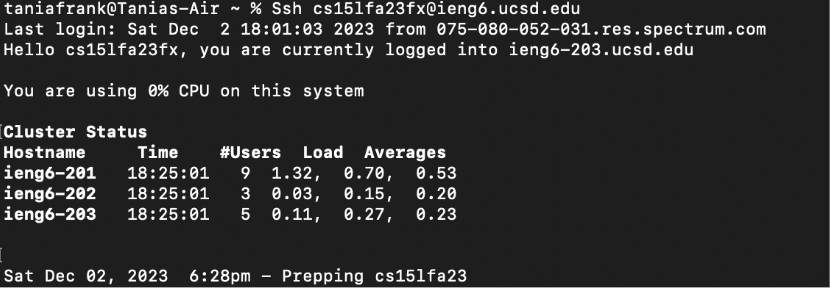

KEYS/TYPED PRESSED: 

`ssh cs15lfa23fx@ieng6.ucsd.edu`

`<enter>`

EXPLANATION: I signed into the remote server using my ssh key. 

5. Clone your fork of the repository from your Github account (using the SSH URL)
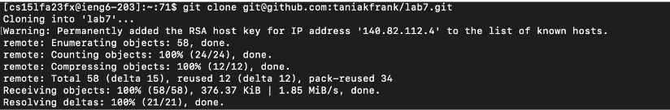

KEYS/TYPED PRESSED: 

`git clone git@github.com:taniakfrank/lab7.git`

`<enter>`

EXPLANATION: I cloned the lab 7 repo fork using my ssh url

7. Run the tests, demonstrating that they fail
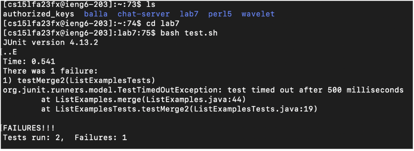

KEYS/TYPED PRESSED: 

`ls`

`<enter>`

`cd lab7`

`<enter>`

`bash test.sh`

`<enter>`

EXPLANATION: I used `ls` to see where i was then changed into the lab7 repo i just cloned. then i ran the listexamples test
by running the bash script in lab 7

8. Edit the code file to fix the failing test
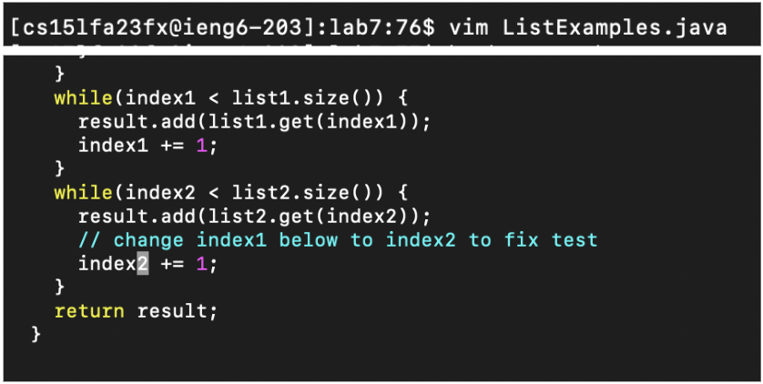

KEYS/TYPED PRESSED:

`vim ListExamples.java`

`<down>`
x 43 times

`<right>`
x 12 times

`i`

`<delete>`

`2`

`<esc>`

`:wq`

`<enter>`

EXPLANATION: I entered vim by typing `vim ListExamples.java`, then pressed down cursor 43 times
to get to the right line, and used the right button 12 times to be to the right of the correct character
to fix. i entered insert mode by pressing `i`, and then deleted the 1 character and typed 
2 to fix the bug. i pressed `esc` to exit insert mode, and exited vim. 

9. Run the tests, demonstrating that they now succeed
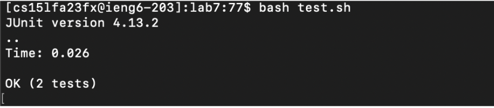

KEYS/TYPED PRESSED: 

`bash test.sh`

`<enter>`

EXPLANATION: same as step 7, i ran the listexamples test by running the bash script in lab 7

10. Commit and push the resulting change to your Github account (you can pick any commit message!)
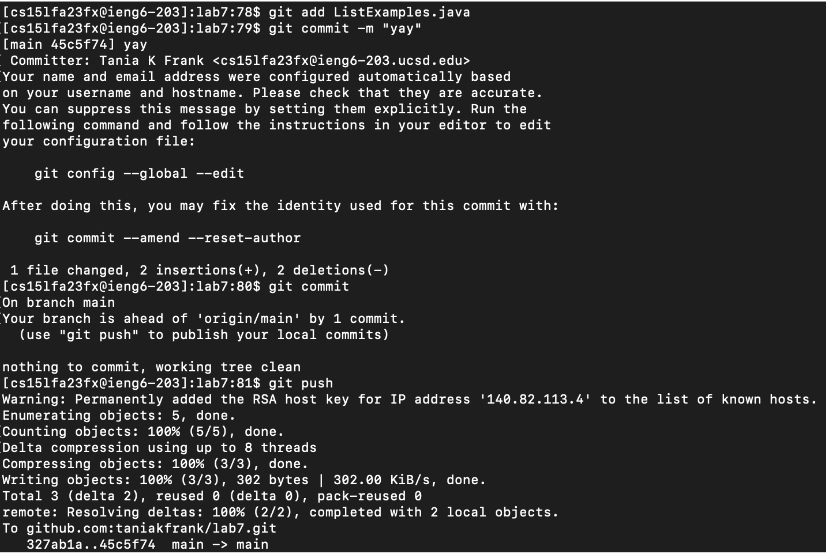

KEYS PRESSED: 

`git add ListExamples.java`

`<enter>`

`git commit -m "yay" `

`<enter>`

`git push`

`<enter>`

EXPLANATION: i committed my fix of the bug in `ListExamples.java` with the "yay" message, and pushed
that to the github repo. 


________________________________________________________________________________________________________________________________________________________________________________
LAB 5---------------------------------------------------------------------------------------------------------------------------------------------------------------------------

PART 1
1. STUDENT
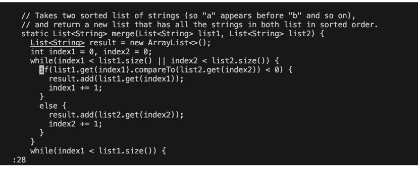


3. TA
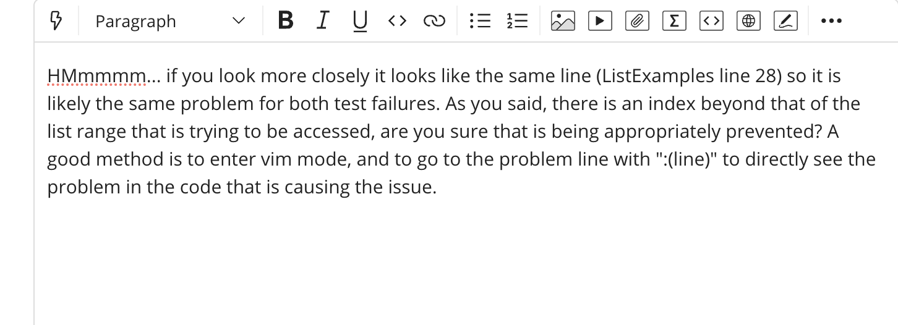


4. STUDENT
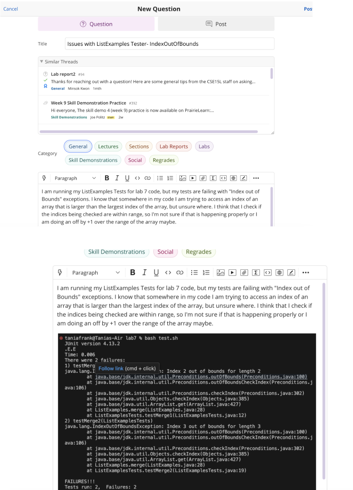


The bug was that in the if statement making sure the index1 and index2 are within bound it checks if either is within index with OR operator `||` not the AND `&&` so only one of the indices had to be within the range. Thus the index of 1 or 2 may not have been within the List's range but was attempted to access because the other was when the tests were run

4. INFO
FILE/DATA STRUCTURE
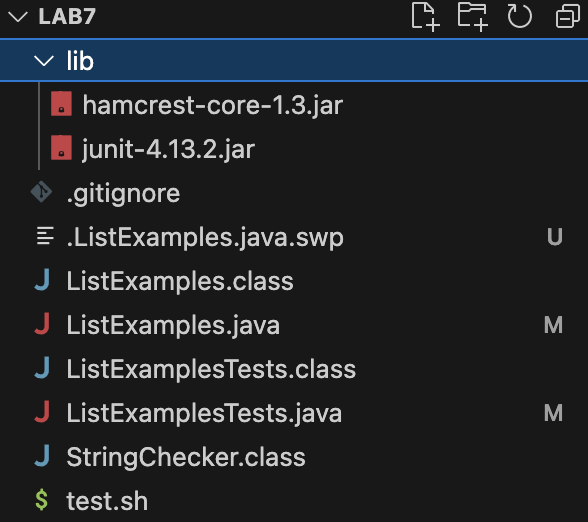

COMMANDS RUN:
1. failure showing:

`bash test.sh`

2. to find the bug as per TA advice:

`vim ListExamples`

`:28`

HOW TO FIX THE BUG: 
Student has to change the `||` to `&&` on Line 27. They can do this directly in the code, or through vim by going into vim mode:
`vim ListExamples`

navigating to line 27: `17`

navigating right to appropriate spot with `<right>`

entering insert mode: `i`

deleting `||`: `<delete>`

replacing: `&&`

exiting insert: `<esc>`

saving and exiting vim: `:wq`

`<enter>`

CONTENTS (Before fixing bug):
ListExamples.java

```
import java.util.ArrayList;
import java.util.List;

interface StringChecker { boolean checkString(String s); }

class ListExamples {

  // Returns a new list that has all the elements of the input list for which
  // the StringChecker returns true, and not the elements that return false, in
  // the same order they appeared in the input list;
  static List<String> filter(List<String> list, StringChecker sc) {
    List<String> result = new ArrayList<>();
    for(String s: list) {
      if(sc.checkString(s)) {
        result.add(0, s);
      }
    }
    return result;
  }


  // Takes two sorted list of strings (so "a" appears before "b" and so on),
  // and return a new list that has all the strings in both list in sorted order.
  static List<String> merge(List<String> list1, List<String> list2) {
    List<String> result = new ArrayList<>();
    int index1 = 0, index2 = 0;
    while(index1 < list1.size() || index2 < list2.size()) {
      if(list1.get(index1).compareTo(list2.get(index2)) < 0) {
        result.add(list1.get(index1));
        index1 += 1;
      }
      else {
        result.add(list2.get(index2));
        index2 += 1;
      }
    }
    while(index1 < list1.size()) {
      result.add(list1.get(index1));
      index1 += 1;
    }
    while(index2 < list2.size()) {
      result.add(list2.get(index2));
      // change index1 below to index2 to fix test
      index2 += 1;
    }
    return result;
  }


}
```

ListExamplesTests.java

```
import static org.junit.Assert.*;
import org.junit.*;
import java.util.*;
import java.util.ArrayList;


public class ListExamplesTests {
	@Test(timeout = 500)
	public void testMerge1() {
    		List<String> l1 = new ArrayList<String>(Arrays.asList("x", "y"));
		List<String> l2 = new ArrayList<String>(Arrays.asList("a", "b"));
		assertArrayEquals(new String[]{ "a", "b", "x", "y"}, ListExamples.merge(l1, l2).toArray());
	}
	
	@Test(timeout = 500)
        public void testMerge2() {
		List<String> l1 = new ArrayList<String>(Arrays.asList("a", "b", "c"));
		List<String> l2 = new ArrayList<String>(Arrays.asList("c", "d", "e"));
		assertArrayEquals(new String[]{ "a", "b", "c", "c", "d", "e" }, ListExamples.merge(l1, l2).toArray());
        }
}
```

Test.sh

```
javac -cp .:lib/hamcrest-core-1.3.jar:lib/junit-4.13.2.jar *.java
java -cp .:lib/hamcrest-core-1.3.jar:lib/junit-4.13.2.jar org.junit.runner.JUnitCore ListExamplesTests
```

PART 2: Reflection
One really cool thing I learned is that you can access and change code from the terminal with vim! I had no ideas you could do that, and although it isn't helpful for big coding or large changes I see the value of being able to toggle through and access a file from the same place you are currently working (terminal). I am only used to text editors but knowing how many ways there are editing a file definitiely shifted my understanding of the software we use to code. 
