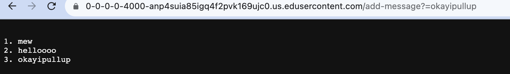
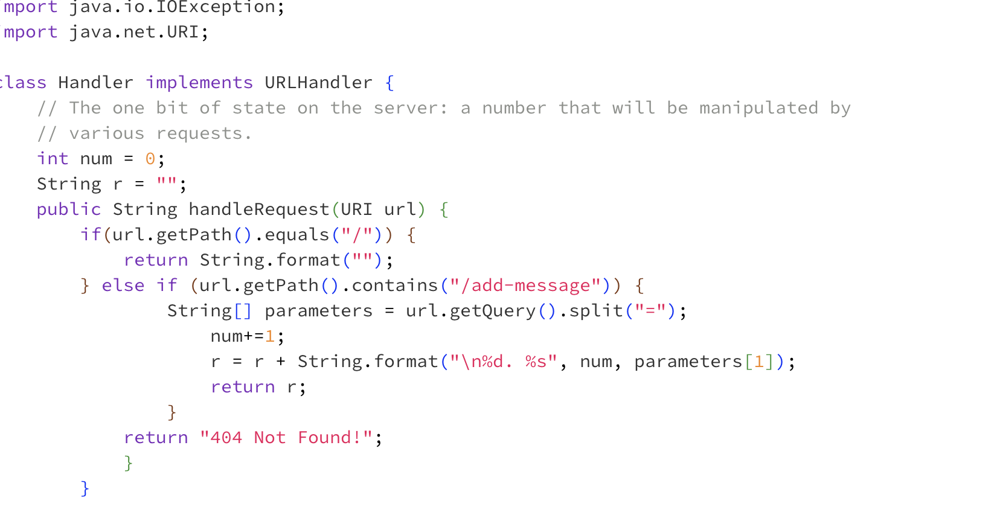
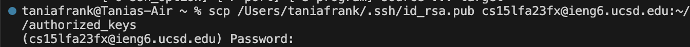

*meow
*woof
*mooo
_________________________________________________________________________________________________
LAB REPORT 1

CD

1. no argument, working directory was simply the home directory because i was working within there, because there was no argument the directory was never changed because i didnt tell the program what directory to switch to, this is not an error! However, when I cd to lecture1, then ran cd w no argument it simply backed up one level to the home directory. this is not an error. 
2. run w directory, when the command was run i changed the directory from simply the repository to lecture1, my output was that i was working within the lecture1 directory as evidenced by my next command line. this makes sense because id told the program to work within the lecture1 directory, this is not an error!
3. run w file, it was within the lecture1 directory when i tried to run w Hello.java, then i changed directory to messages and tried to run the txt files. i got the error outputs because i passed in a file name as arguments, but you can't work within a file and that argument isn't accepted for the cd command (literally tells you it changes to a directory), so this is an error!

LS

1. no argument, i was in the messages directory when i ran this so the output was a list of the text files with "hello world" in a couple different languages because those were the files within the messages directory, and the ls command lists the contents in a directory, so this is not an error!
2. directory, i did this twice. the first time (picture 1) i was working within the messages directory, and it gave me an error message that said it could not access the file or directory. that is because i was already in there and it was looking for a directory within the one i was already in. however, in picture 2 i backed out using cd .., and when i worked within the lecture1 directory, and ran ls messages the terminal successfully listed the text files within messages
3. run w file, in picture 1 under ls i was in the messages directory and ran ls en-us.txt. it outputted the contents of the file which is simply itself, this is not an error

   
CAT

1. no argument, i was in the messages directory and it simply returned my cursor down the terminal and let me type within the terminal freely- that is where i tried to run cat messages and then it simply reprinted what id typed. this is not an error
2. run w directory, in the first picture you can see it says no such file or directory which is not error message when i ran it within the messages directory. however, i backed out to just the repository (picture 2) and found the cat lecture 1 outputted a descritpion of lecture1 as a directory. when i tried to run cat messages, i got a message that said there is no such file or directory, this is not an error. I suppose cat only works on the first layer and didn't search the lecture1 directory for the messages directory another layer deeper.
3. run w file, in picture 1 under cat i was in the messages directory and i ran cat en-us.txt, which printed the contents of the file to the terminal because id passed the file name as an argument into the command. this is not an error

______________________________________________________________________________________________________
Lab Report 2

PART 1

This calls the `handlerequest` method, and the relevant fields are `r` and `num`. `r` changed from "1. mew" to "1. mew \n 2. hellooo", and `num` changed from 1 to 2. The url i typed in was passed in, the path was "/add-message?=hellooo". all fields changed. 

This calls the `handlerequest` method, and the relevant fields are `r` and `num`. `r` changed from "1. mew \n 2. hellooo" to "1. mew \n 2. hellooo \n 3. okayipullup", and `num` changed from 2 to 3. The url i typed in was passed in, the path was "/add-message?=okayipullup". all fields changed. 

below is my code for StringServer!

PART 2

I added the ls commands in terminal- it didn't print out the whole path, but the TA told me to pwd, then ls the file to show that it is there and present in that absolute file path!

PART 3
I didn't know that you could remotely connect to a computer, that was new to me. My understanding for the most part was that we run things from the coputer we are physically on, so learning how to do that conceptually was cool. I suppose, specifically the ssh command and the process of logging into my cs15l account
/Users/taniafrank/.ssh/id_rsa.pub

--------------------------------------------------------------------------------------------------------------------------------
LAB 3

Part 1
A failure-inducing input for the buggy program, as a JUnit test and any associated code (write it as a code block in Markdown)
I am choosing the bug in arraymethods!
These are the failure inducing inputs, junit tests
`@Test
public void testReverseInPlacefive() {
int[] input1 = {1,2,3,4,5 };
ArrayExamples.reverseInPlace(input1);
assertArrayEquals(new int[]{5,4,3,2,1 }, input1);
}
`
An input that doesn’t induce a failure, as a JUnit test and any associated code (write it as a code block in Markdown)

`@Test
public void testReverseInPlace-singular() {
int[] input1 = {3};
assertArrayEquals(new int[]{3}, ArrayExamples.reversed(input1));
}
`
The symptom, as the output of running the tests (provide it as a screenshot of running JUnit with at least the two inputs above)

The bug, as the before-and-after code change required to fix it (as two code blocks in Markdown)
Before

  `static void reverseInPlace(int[] arr) {
    int[] newArray = arr;
    for(int i = 0; i < arr.length; i += 1) {
      arr[i] = newArray[arr.length - i - 1];
    }
    
  }`
  
After

   `static void reverseInPlace(int[] arr) {
    int[] newArray = arr;
    for(int i = 0; i < arr.length; i += 1) {
      newArray[i] = arr[arr.length - i - 1];
    }
    for(int i = 0; i < arr.length; i +=1){
      arr[i] = newArray[i];
    }
    
  }`
  
This fixes the problem because in the old version its trying to assign values from the array that hasn't been set yet to the old one. In this change I copy the values in the old array to the new one, reversed. Then copy it back. You can't do it all in one step because we need access to values on the flip side of the array.

PART 2
