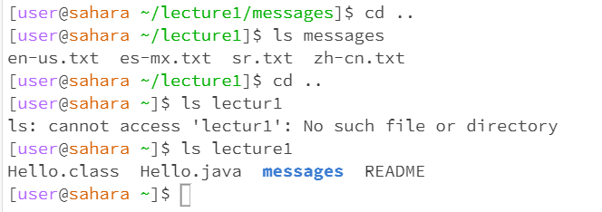

*meow
*woof
*mooo
_________________________________________________________________________________________________
LAB REPORT 1
CD

1. no argument, working directory was simply the repository because i was working within there, because there was no argument the directory was never changed because i didnt tell the program what directory to switch to, this is not an error!
2. run w directory, when the command was run i changed the directory from simply the repository to lecture1, my output was that i was working within the lecture1 directory as evidenced by my next command line. this makes sense because id told the program to work within the lecture1 directory, this is not an error!
3. run w file, it was within the lecture1 directory when i tried to run w Hello.java, then i changed directory to messages and tried to run the txt files. i got the error outputs because i passed in a file name as arguments, but you can't work within a file and that argument isn't accepted for the cd command (literally tells you it changes to a directory), so this is an error!

LS

1. no argument, i was in the messages directory when i ran this so the output was a list of the text files with "hello world" in a couple different languages because those were the files within the messages directory, and the ls command lists the contents in a directory, so this is not an error!
2. directory, i did this twice. the first time (picture 1) i was working within the messages directory, and it gave me an error message that said it could not access the file or directory. that is because i was already in there and it was looking for a directory within the one i was already in. however, in picture 2 i backed out using cd .., and when i worked within the lecture1 directory, and ran ls messages the terminal successfully listed the text files within messages
3. run w file, in picture 1 under ls i was in the messages directory and ran ls en-us.txt. it outputted the contents of the file which is simply itself, this is not an error
CAT

1. no argument, i was in the messages directory and it simply returned my cursor down the terminal and let me type within the terminal freely- that is where i tried to run cat messages and then it simply reprinted what id typed. this is not an error
2. run w directory
3.
