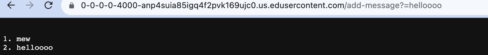
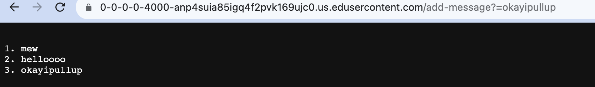
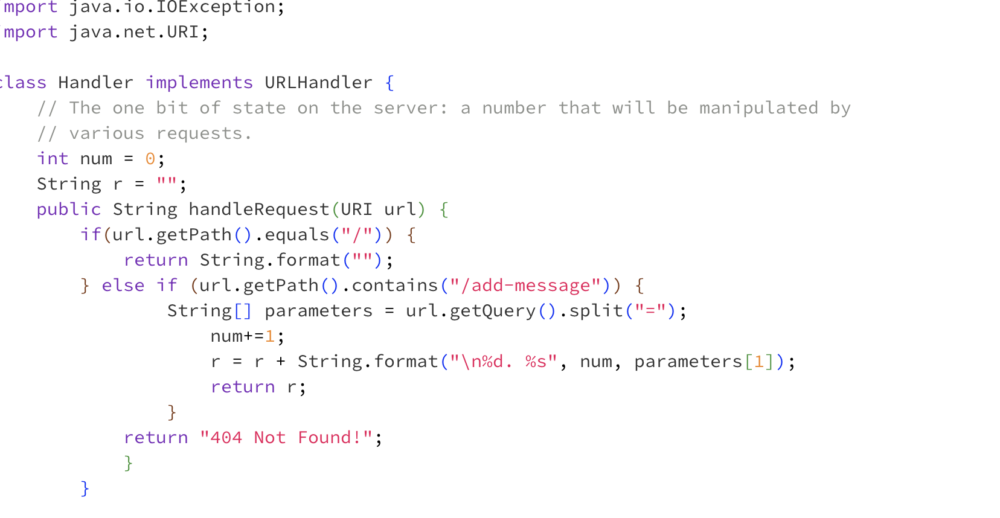
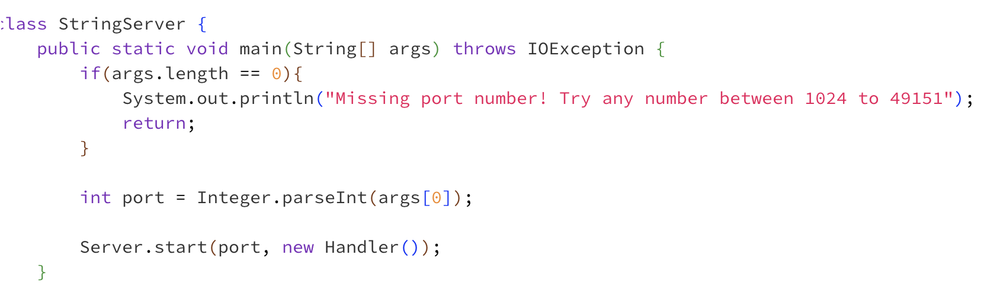
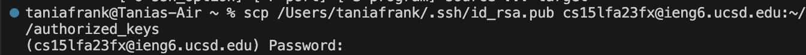
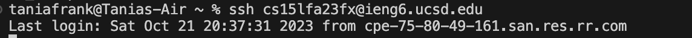

______________________________________________________________________________________________________
Lab Report 2

PART 1

This calls the handle request method, and the relevant fields are r and num. r changed from "1. mew" to "1. mew \n 2. hellooo", and n changed from 1 to 2. The url i typed in was passed in, the path was "/add-message?=hellooo". all fields changed. 

This calls the handle request method, and the relevant fields are r and num. r changed from "1. mew \n 2. hellooo" to "1. mew \n 2. hellooo \n 3. okayipullup", and n changed from 2 to 3. The url i typed in was passed in, the path was "/add-message?=okayipullup". all fields changed. 

below is my code for StringServer!

PART 2

